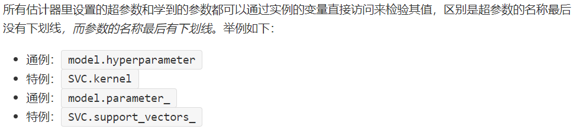

# 引言
分类模型、回归模型、聚类与降维模型、预处理器等等都叫做估计器(estimator)

内容介绍：
1. 机器学习基础知识：机器学习定义与四要素：数据、任务、性能度量和模型
2. SKLearn：API设计原理，sklearn几大特点：一致性、可检验、标准类、可组合和默认值，以及SKLearn自带数据以及储存格式
3. SKLearn三大核心API：包括估计器、预测器和转换器
4. SKLearn高级API：包括简化代码量的流水线(Pipeline估计器)，集成模型(Ensemble估计器)、有多类别-多标签-多输出分类模型(Multiclass 和 Multioutput 估计器)和模型选择工具(Model Selection估计器)

# 机器学习简介
机器学习四元素：数据(Data)、任务(Task)、性能度量(Quality Metric)、算法(Algorithm)

## 数据
数据(data)是信息的载体

结构化数据：由二维表结构来逻辑表达和实现的数据
对于非结构数据，通常神经网络有更好的效果
**术语**

样本(sample)：每行的记录(这是一朵鸢尾花的数据统计)
特征(feature)：反映样本在某方面的性质，例如萼片长度(Sepal Length)、花瓣长度(Petal Length)
特征值(feature value)：特征上的取值，例如「样本1」对应的5.1、3.5
类别标签(class label)：关于样本结果的信息，例如Setosa、Versicolor
样例(instance)：包含标签信息的示例，样例=(特征，标签)
学习/训练(learning/training)：从数据中学得模型的过程
训练样例(training instance)：训练数据中的每个样例

## 任务

监督学习、无监督学习、半监督学习、强化学习

## 性能度量
回归问题的性能度量：
平均绝对误差、均方误差、均方根误差、R2决定系数


分类问题的性能度量
精确率、查全率、查准率、$F_{\beta}-Score$


# SKLearn数据
包含六个任务模块和一个数据导入模块，分别是
1. 监督学习：分类任务
2. 监督学习：回归任务
3. 无监督学习：聚类任务
4. 无监督学习：降维任务
5. 模型选择任务
6. 数据预处理任务
7. 数据导入模块

## SKLearn默认数据格式
能直接使用的数据格式有这样两种
1. Numpy二维数组(ndarray)的稠密数据(dense data)
2. SciPy矩阵(scipy.sparse.matrix)的稀疏数据(sparse data)

## 自带数据集
举个例子，鸢尾花数据集
```python
# 导入工具库
from sklearn.datasets import load_iris    
iris = load_iris()
#数据是以「字典」格式存储的，看看 iris 的键有哪些。
iris.keys()
```
## 数据集引入方式
三种引入数据的方式
`sklearn.datasets.load_*`：打包好的小数据集
`sklearn.datasets.fetch_*`:分流下载的大数据集
`sklearn.datasets.make_*`: 展示自己创建的大数据集

# SKLearn核心API
模型包括：回归、分类、聚类、降维
流程包括：预处理、网格搜索交叉验证
三大API：
估计器(estimator)通常是用于拟合功能的估计器
预测器(predictor)是具有预测功能的估计器
转换器(transformer)是具有转换功能的估计器

## 估计器
基于数据集对一些参数进行估计的对象

创建估计器：创建的同时设置超参数
如线性回归中的`normalize=True`（这个参数在高版本的scikit-learn中已经被舍弃了）
K-means中的`n_clusters=5`
拟合估计器：使用训练集
无监督学习：`model.fit(X_train)`
有监督学习：`model.fit(X_train, y_train)`
得到model的参数：
线性回归中的特征系数：`model.coef_`
K-means中的聚类标签：`model.labels_`

### 估计器通用伪代码
```python
# 有监督学习
from sklearn.xxx import SomeModel
# xxx 可以是 linear_model 或 ensemble 等
model = SomeModel( hyperparameter )
model.fit( X, y )

# 无监督学习
from sklearn.xxx import SomeModel
# xxx 可以是 cluster 或 decomposition 等
model = SomeModel( hyperparameter )
model.fit( X )
```

## 预测器
对数据进行预测

预测器都有predict()方法和score()方法
但不是每个预测器都有predict_proba()方法（主要用于概率估计型的分类模型，如逻辑回归和probability=True的SVC）和decision_function()方法（主要用于决策函数型的分类模型，如SVC）
使用时查阅官方文档

### 预测器通用伪代码
```python
# 有监督学习
from sklearn.xxx import SomeModel
# xxx 可以是 linear_model 或 ensemble 等
model = SomeModel( hyperparameter )
model.fit( X, y )
y_pred = model.predict( X_new )
s = model.score( X_new, y_new)

# 无监督学习
from sklearn.xxx import SomeModel
# xxx 可以是 cluster 或 decomposition 等
model = SomeModel( hyperparameter )
model.fit( X )
idx_pred = model.predict( X_new )
s = model.score( X_new )
```

## 转换器
对比预测器：预测器做完拟合来预测，转换器做完拟合来转换
估计器：`fit+predict`
转换器：`fit+transform`

主要介绍两大转换器：类别型变量编码和特征缩放
类别编码：将类别型变量(categorical)编码成数值型变量(numerical)
特征缩放：规范化(normalize)或标准化(standardize)数值型变量
### 类别型变量编码

#### LabelEncoder&OrdinalEncoder
LabelEncoder和OrdinalEncoder都可以将字符转成数字
LabelEncoder的input为一维向量，如1d ndarray
OrdinalEncoder的input为二维向量，如DataFrame
缺点：编码结果会带来不同类别的大小关系，但实际上有些问题中的不同类别是一个平等的关系，并没有大小关系

#### OneHotEncoder
把一个整数用向量的形式表现
OneHotEncoder接受两种类型的input：用LabelEncoder编码好的一维数组、DataFrame
具体使用包括：
1. 用LabelEncoder编码好的一维数组(元素为整数)，重塑(用reshape(-1,1))成二维数组作为OneHotEncoder输入
2. 用DataFrame作为OneHotEncoder输入

### 特征缩放
两种变换方法：
1. 标准化(standardization)：每个维度的特征减去该特征均值，除以该维度的标准差，使用`MinMaxScalar`
2. 规范化(normalization)：每个维度的特征减去该特征最小值，除以该特征的最大值与最小值之差，使用`StandardScalar`

注意事项：
`fit`只能在训练集上做，在测试集上做`transform`就好
通常的做法是`fit_transform(X_train)`，`transform(X_test)`

# 高级API
五大元估计器：
集成功能的Ensemble，多分类和多标签的Multiclass，多输出的Multioutput，选择模型的Model Selection，流水线的Pipeline

## Ensemble 估计器

分类器统计每个子分类器的预测类别数，再用「多数投票」原则得到最终预测
回归器计算每个子回归器的预测平均值

常用Ensemble估计器：
`AdaBoostClassifier`：逐步提升分类器
`AdaBoostRegressor`：逐步提升回归器
`BaggingClassifier`：Bagging分类器
`BaggingRegressor`：Bagging回归器
`GradientBoostingClassifier`：梯度提升分类器
`GradientBoostingRegressor`：梯度提升回归器
`RandomForestClassifier`：随机森林分类器
`RandomForestRegressor`：随机森林回归器
`VotingClassifier`：投票分类器
`VotingRegressor`：投票回归器

### RandomForestClassifier

随机森林`RandomForestClassifier`由若干个决策树组成，通过控制`n_estimators`超参数来决定基估计器的个数

### VotingClassifier

投票分类器VotingClassifier由若干个异质分类器组成，举个例子，我们可以创建一个包含逻辑回归(Logistic regression)、随机森林(RandomForest)和高斯朴素贝叶斯(GNB)三个分类器的集成模型
同时对比随机森林只需通过控制`n_estimators`来决定树的个数，VotingClassifier需要输入每个异质分类器

## Multiclass估计器

`sklearn.multiclass`可以处理多类别(multi-class) 的多标签(multi-label) 的分类问题

### 多类别分类
使用二分类估计器来做多分类问题的思路


1. 一对一(One vs One，OvO)：一个分类器用来处理数字0和数字1，一个用来处理数字0和数字2，一个用来处理数字1和2，以此类推。N个类需要N(N-1)/2个分类器
2. 一对其他(One vs All，OvA)：训练10个二分类器，每一个对应一个数字，第一个分类「1」和「非1」，第二个分类「2」和「非2」，以此类推。N个类需要N个分类器。

#### OneVSOneClassifier
考虑一个天气多分类的问题，晴天、雨天和阴天，三个分类器为f1、f2、f3
f1分类橙色和绿色
f2分类橙色和紫色
f3分类绿色和紫色
在具体实现时，考虑多数原则，当f1和f2都预测为橙色时，不管f3预测为紫色还是绿色，我们都可以说这个样例应该被预测为橙色


#### OneVSRestClassifier
同样考虑前面所述的天气分类问题，同样需要三个分类器f1、f2、f3
其中f1将橙色预测为正类
f2将绿色预测为正类
f3将紫色预测为正类
同样考虑多数原则，当f1预测负类，即预测绿色和紫色，f2预测负类，即预测橙色和紫色，f3预测正类，即预测紫色，最后的结果即为紫色


### 多标签分类
针对这样的问题：让分类器给一个样例输出多个类别
举个例子，在手写数字的例子上，我们特意为每个数字设计了两个标签：
标签1：奇数、偶数
标签2：小于等于4，大于4


## Multioutput估计器
`sklearn.multioutput`可以处理多输出(multi-output)的分类问题
理解：多输出分类是多标签分类的泛化，每一个标签可以是多类别(大于两个类别)的。举个例子，如预测图片每一个像素(标签)的像素值是多少(从0到255的256个类别)。一张图片中有很多个像素，对应的就是很多个分类标签，即多标签分类，每个像素的分类结果为0~255，即多类别分类问题


Multioutput估计器分为：
`MultiOutputRegressor`：多输出回归
`MultiOutputClassifier`：多输出分类

## Model Selection估计器

常见的Model Selection估计器:
`cross_validate`：评估交叉验证的结果。
`learning_curve`：构建与绘制学习曲线。
`GridSearchCV`：用交叉验证从超参数候选网格中搜索出最佳超参数。
`RandomizedSearchCV`：用交叉验证从一组随机超参数搜索出最佳超参数。

### 交叉验证
K-折交叉验证(K-fold cross validation set)：把整个数据集平均但随机分成K份，每份大概包含m/K个数据(m 是总数据数)，每次选K-1份作为训练集拟合参数，在剩下1份验证集上进行评估计算。由于遍历了这K份数据，因此该操作称为交叉验证
K-fold交叉验证图示如下：


调参的估计器包括 网格搜索和随机搜索两种


## Pipeline估计器
Pipeline估计器又叫流水线，把各种估计器串联(Pipeline)或并联(FeatureUnion)的方式组成一条龙服务


### Pipeline
将若干个估计器按顺序连在一起，比如：特征提取 → 降维 → 拟合 → 预测，其属性和最后一个估计器的属性相同
举个构建pipeline的例子：构建方式——使用Pipeline()函数，由(名称，估计器)组建的元组列表
```python
pipe = Pipeline([('impute', SimpleImputer(missing_values=np.nan, strategy='mean')),
                ('normalize', MinMaxScaler())])
```

### FeatureUnion
在一个节点同时运行几个估计器的实现方法
示例：对一个DataFrame中的数据进行清洗

对DataFrame中的类别型变量和数值型变量的数据清洗是同时进行的

# 总结
## SKLearn五大原则
1. 一致性

2. 可检验

3. 标准类
SKLearn模型接受的数据集的格式只能是「Numpy数组」和「Scipy稀疏矩阵」。
超参数的格式只能是「字符」和「数值」。
4. 可组成
模块都能重复「连在一起」或「并在一起」使用，比如两种形式流水线(pipeline)
·任意转换器序列
·任意转换器序列+估计器
5. 有默认
SKLearn给大多超参数提供了合理的默认值

## SKLearn框架流程
1. 确定任务
是「有监督」的分类或回归？还是「无监督」的聚类或降维？
2. 数据预处理
处理缺失值、异常值
编码类别型变量
正规化或标准化数值型变量
合理使用pipeline神器让一切变得简单
3. 训练和评估
训练用估计器fit()先拟合，评估用预测器predict()来评估
4. 选择模型
启动ModelSelection估计器里的GridSearchCV和RandomizedSearchCV，选择得分最高的那组超参数(即模型)