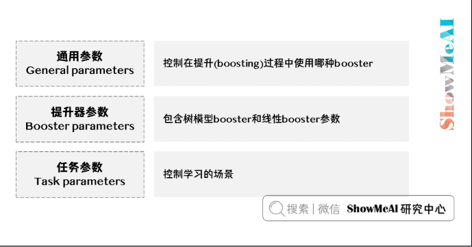

# 引言
XGBoost是eXtreme Gradient Boosting的缩写称呼
一个非常强大的Boosting算法工具包
XGBoost在并行计算效率、缺失值处理、控制过拟合、预测泛化能力上都变现非常优秀。
# XGBoost数据读取
**XGBoost支持的数据格式**
·libsvm格式的文本数据
·Numpy的二维数组
·XGBoost的二进制的缓存文件，存储在对象DMatrix中

**数据加载示例**
加载libsvm格式的数据：
```python
dtrain1 = xgb.DMatrix('train.svm.txt')
```

加载二进制的缓存文件：
```python
dtrain2 = xgb.DMatrix('train.svm.buffer')
```

加载numpy数组
```python
data = np.random.rand(5,10) # 5 entities, each contains 10 features
label = np.random.randint(2, size=5) # binary target
dtrain = xgb.DMatrix( data, label=label)
```

scipy.sparse格式的数据加载
```python
csr = scipy.sparse.csr_matrix( (dat, (row,col)) )
dtrain = xgb.DMatrix( csr )
```

将DMatrix格式的数据保存成XGBoost的二进制格式，在下次加载时可以提高加载速度
```python
dtrain = xgb.DMatrix('train.svm.txt')
dtrain.save_binary("train.buffer")
```

处理DMatrix中的缺失值：
```python
dtrain = xgb.DMatrix( data, label=label, missing = -999.0)
```

给样本设置权重：
```python
w = np.random.rand(5,1)
dtrain = xgb.DMatrix( data, label=label, missing = -999.0, weight=w)
```

# XGBoost不同建模方式
## 内置建模方式：csv格式数据源
使用`pandas`读取数据，得到Dataframe格式的数据，再将数据构建成Dmatrix格式，再使用内置建模方式进行训练
```python
# 取出Dataframe的numpy数组值去初始化DMatrix对象
xgtrain = xgb.DMatrix(train[feature_columns].values, train[target_column].values)
xgtest = xgb.DMatrix(test[feature_columns].values, test[target_column].values)
#参数设定
param = {'max_depth':5, 'eta':0.1, 'silent':1, 'subsample':0.7, 'colsample_bytree':0.7, 'objective':'binary:logistic' }
# 设定watchlist用于查看模型状态
watchlist  = [(xgtest,'eval'), (xgtrain,'train')]
num_round = 10
bst = xgb.train(param, xgtrain, num_round, watchlist) # 参数设置
```


## 预估器建模方式：SKLearn接口+Dataframe
使用SKLearn中统一的预估器形态接口进行建模

```python
# 初始化模型
xgb_classifier = xgb.XGBClassifier(n_estimators=20, max_depth=4, learning_rate=0.1, subsample=0.7,colsample_bytree=0.7, eval_metric='error')
# Dataframe格式数据拟合模型
xgb_classifier.fit(train[feature_columns], train[target_column])
# 使用模型预测
preds = xgb_classifier.predict(test[feature_columns])
```

# 模型调参与高级功能
## XGBoost参数详解
三种类型的参数：
general parameters，booster parameters和task parameters

### 通用参数

·booster [default=gbtree] 
·silent [default=0]
·nthread
·num_pbuffer: buffer缓冲用于保存最后一步提升的结果，无需人为设置
·num_feature: 无需人为设置

### 树模型booster参数

·eta [default=0.3]
·gamma [default=0]
·max_depth [default=6]
·min_child_weight [default=1]：如果一个叶子节点的样本权重和小于min_child_weight则拆分过程结束
·subsample [default=1]：起到防止过拟合的作用
·colsample_bytree [default=1]

### 线性Booster参数


### 任务参数

·objective [ default=reg:linear ]
可选的目标函数包括
`reg:linear`: 线性回归
`reg:logistic`: 逻辑回归
`binary:logistic`: 二分类的逻辑回归问题，输出概率
`binary:logitraw`: 二分类的逻辑回归问题，输出wTx
`count:poisson`: 计数问题的poisson回归，输出结果为poisson分布，max_delta_step的缺省值为0.7
`multi:softmax`: 用softmax目标函数处理多分类问题，需要设置参数num_class(类别个数)
`multi:softprob`: 输出ndata * nclass的向量以解决多分类问题
`rank:pairwise`: 解决排序任务，使用pairwist loss计算损失
·base_score [ default=0.5 ]
所有实例的初始化预测分数
·eval_metric [ default according to objective ]
`rmse`：均方根误差
`logloss`：负对数似然
`error`：二分类错误率。 #(错误案例)/#(所有案例)。 对于预测，评估将预测值大于0.5的实例视为正实例，其他实例视为负实例。
`merror`：多分类错误率。 #(错误案例)#(所有案例)。
`mlogloss`：多分类对数损失
`auc`：排名评估的曲线下面积
`ndcg`：归一化累积增益
map：平均准确率
`ndcg@n,map@n`：n可以分配为整数，以对列表中的顶部位置进行评估。
`ndcg-,map-,ndcg@n-,map@n-`：在XGBoost中，NDCG和MAP将没有正样本的列表的得分评为1。 通过添加-，XGBoost将这些得分评为0，以在某些条件下保持一致。
·seed [ default=0 ]

## 内置调参优化
### 交叉验证
`xgb.cv`方法
```python
xgb.cv(param, dtrain, num_round, nfold=5,metrics={'error'}, seed = 0)
```

### 添加预处理
比如将对于不同类别样本的加权考虑到交叉验证中去

### 自定义损失函数和评估准则
损失函数的定义需要返回损失函数一阶和二阶导数的计算方法
评估准则部分需要对数据的label和预估值进行计算
损失函数用于训练过程中的树结构学习，而评估准是用在验证集上进行效果评估

